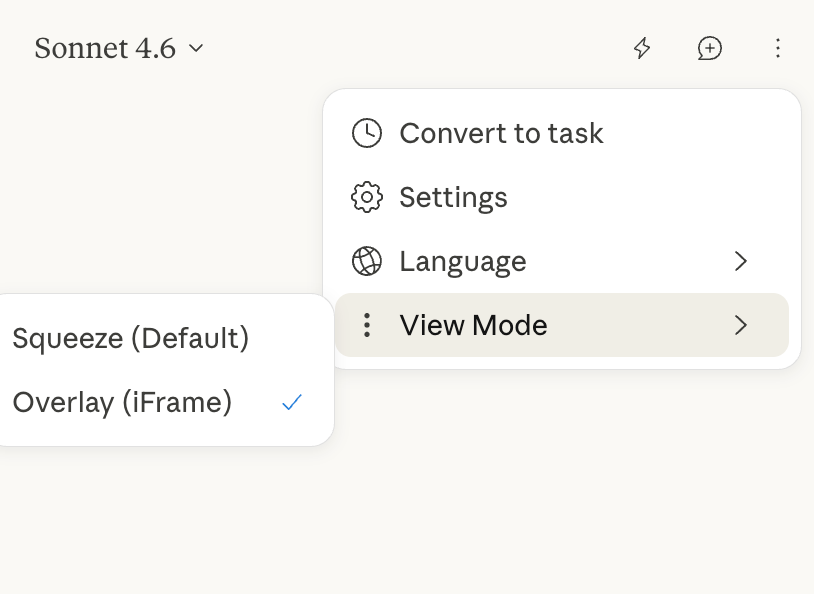

# Claude in Arc

A deep patching toolkit designed to inject Anthropic's Official Claude Chrome Extension natively into Arc Browser's visual structure.

Because Arc doesn't officially support Chrome's `chrome.sidePanel` APIs natively yet, this project intercepts the extension's unpacked local files and re-wires them to run as an injected iFrame, matching Arc's aesthetic perfectly.

## What's New in v0.2

- Added **View Mode** selection — switch between two sidepanel injection modes: Squeeze (Default) and Overlay (iFrame)
- Established connection with Claude Desktop via Native Messaging
- Bug fixes

## Installation

Download the ZIP from [Releases](https://github.com/chxsong/Claude-in-Arc/releases), or download the `1.0.66_0` folder directly from this repository and load it as an unpacked extension.

## Uninstallation

Go to `arc://extensions` and click **Remove Extension**.
