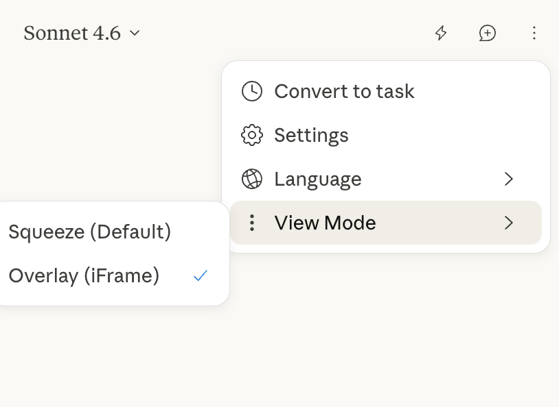

# Claude in Arc

A deep patching toolkit designed to inject Anthropic's Official Claude Chrome Extension natively into Arc Browser's visual structure.

Because Arc doesn't officially support Chrome's `chrome.sidePanel` APIs natively yet, this project intercepts the extension's unpacked local files and re-wires them to run as an injected iFrame, matching Arc's aesthetic perfectly.

## What's New in v0.3

- **Builds against whatever Claude release is current.** `./build.sh` fetches the official extension from Google's update endpoint, verifies it carries Anthropic's signing key, and applies the patch on top. No more snapshot going stale between releases.
- **The patch is separated from the bundle.** `patch/` holds only this project's own code; Anthropic's bundle is no longer vendored in the repository.
- **Fixed `rules.json`.** Two of the four redirect rules pointed at SVGs that were never committed. Chrome rejects a static ruleset wholesale when a redirect target is missing, so *none* of the four rules were being applied.

## What's New in v0.2

- Added **View Mode** selection — switch between two sidepanel injection modes: Squeeze (Default) and Overlay (iFrame)
- Established connection with Claude Desktop via Native Messaging
- Bug fixes



## Installation

### Build it (recommended)

Requires `python3`. Nothing else.

```sh
./build.sh
```

This downloads the current official Claude extension, checks its signature, patches it, and writes `dist/Claude-in-Arc`. Then:

1. Go to `arc://extensions` and **remove the official Claude extension** if you have it. The patched build reuses Anthropic's extension ID, so the two cannot coexist — Arc will refuse to load the unpacked folder while the Web Store copy is installed.
2. Enable **Developer mode**.
3. Click **Load unpacked** and select `dist/Claude-in-Arc`.

Keep the folder where it is: Arc re-reads it on every launch.

Useful flags:

```sh
./build.sh --crx path/to/claude.crx   # patch a CRX you already have, no download
./build.sh --label v0.4               # set the name shown in arc://extensions
```

### Prebuilt

The `1.0.66_0` folder and the [Releases](https://github.com/chxsong/Claude-in-Arc/releases) ZIP hold the v0.2 build, pinned to Claude 1.0.66. They do not auto-update and lag the current Claude release.

## Uninstallation

Go to `arc://extensions` and click **Remove Extension**.

## How the patch works

The patch is **purely additive**. It never modifies one of Anthropic's minified bundles — that property is what lets it survive version bumps, and what makes it auditable.

Only three official files are rewritten, all mechanically:

| File | Change |
|---|---|
| `manifest.json` | drops `update_url`, adds the `declarativeNetRequest` ruleset, appends two content scripts and one `web_accessible_resources` entry |
| `service-worker-loader.js` | wraps the official import — the shim loads first, the Arc modules after |
| `sidepanel.html` | retitled, plus `theme-init.js` and `cmd-e-fallback.js` |

Everything else lives in `patch/`:

| File | Role |
|---|---|
| `arc-sidepanel-shim.js` | polyfills `chrome.sidePanel`, which Arc does not implement, and forwards open/close to the content script |
| `claude-panel-injector.js` | injects the panel iframe (Squeeze / Overlay modes) |
| `arc-bridge-interceptor.js` | re-implements the MCP tools that silently fail under Arc (`navigate`, `get_page_text`, `computer`, the `tabs_*_mcp` family) |
| `arc-adapter.js` | browser operations driven from Claude Desktop over native messaging |
| `arc-zoom-handler.js` | zoom level and tab id lookups for the injector |
| `viewport-override.js` | keeps page viewport units correct while the panel squeezes the page |
| `cmd-e-fallback.js` | ⌘E from inside the iframe, where the extension command never fires |
| `theme-init.js` | stubs `chrome.tabGroups` and sets the colour mode before first paint |
| `rules.json` | serves a few claude.ai chip icons locally |

`tools/verify-build.py` runs after every build and checks the invariants Arc reports only as a generic "could not load extension": valid manifest JSON, every referenced file present, every DNR redirect target present, the shim imported first, and the Arc modules parsing.

## Notes

The build reuses Anthropic's extension ID, which is what lets it keep the Claude Desktop pairing and the `claude.ai` connection working. It also means the patched build is *not* the official extension: it does not auto-update, so rebuild after each Claude release to pick up upstream fixes.
